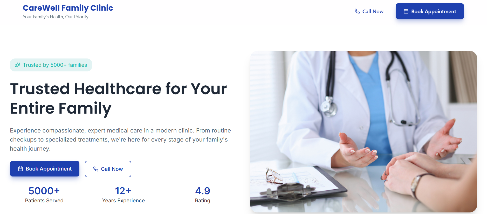
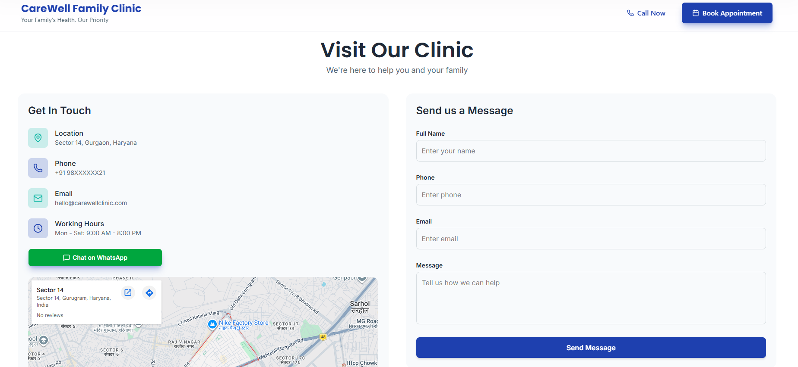

### CareWell Family Clinic - Landing Page for Clinics

 A modern, responsive and user-friendly landing page designed for a family clinic to showcase services and enable easy appointment booking.

---

## 🌐 Live Preview  
[Carewell Clinic ](https://carewell-clinic.vercel.app/)

---

## 📸 Screenshots  





---

## 🚀 Tech Stack  

<p align="center">


</p>

---

## ⚡ Features  

- Fully responsive design  
- Clean and modern UI  
- Smooth animations using Framer Motion  
- Appointment booking section  
- Embedded map integration  
- Clickable footer quick links  

---

## 🛠️ Installation  

```bash
git clone https://github.com/your-username/carewell-clinic.git
cd carewell-clinic
npm install
npm run dev
```

---

## ⭐ Support  

If you like this project, give it a ⭐ on GitHub!
